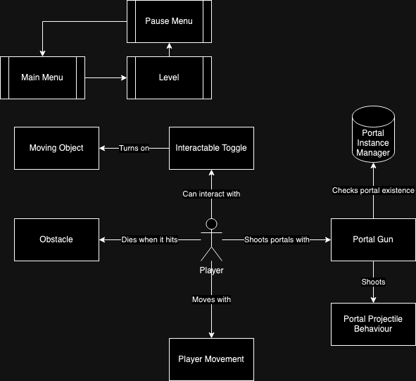

# Mage Way For Me

Tanggal             : 10/1/2025
Document Version    : 1

## Tools

Game Engine             : Unity
Programming Language    : C#

## Gameplay Mechanics

In this game system, the player is the central entity, controlled through a Player Movement component that manages their navigation within the game level. The player is equipped with a Portal Gun, which interacts with the Portal Projectile Behaviour to shoot and instantiate portals. These portals are tracked and managed by the Portal Instance Manager, ensuring proper portal placement and functionality. The player can interact with an Interactable Toggle, which triggers and controls the state of Moving Objects within the environment. Additionally, the player must avoid Obstacles, which are programmed to cause the player’s death upon collision. The game flow is managed through a Main Menu, allowing access to the Level, and a Pause Menu that can be accessed during gameplay for additional controls or options. This interconnected system of components ensures smooth gameplay and interaction within the game environment.

### Features

- [Portal Teleportation](mechanics/Portal_Teleportation.md)
- [Portal Gun](mechanics/Portal_Gun.md)
- [Settings Menu](mechanics/Settings.md)
- [Interactable Toggle](mechanics/Interactable_Toggle.md)
- [Moving Object](mechanics/Moving_Object.md)
- [Obstacle Object](mechanics/Obstacle.md)
- [Win Condition](mechanics/Win_Trigger.md)
- [Section Switcher](mechanics/Section_Switcher.md)

## Technical Difficulties

### Challenge 1
Problem     : Player keeps cloning when entering a portal.
Solution: The `TeleportData` class is responsible for keeping track of clone instances to ensure that there is only one active clone at any given time. This is achieved by maintaining a reference to the current clone and checking for existing instances before creating a new one. If a clone already exists, the system will either update its position or prevent the creation of a new clone, thereby avoiding duplication and potential conflicts within the game world. This solution helps maintain the integrity of the game's teleportation mechanics and ensures a smooth player experience.

### Challenge 2
Problem     : Portal placement isn't being placed in the right the direction.
Solution: To ensure proper portal placement and avoid clipping issues, the system checks for availability in the four main directions (up, down, left, and right) from the intended portal location. If a suitable position is not found in the immediate vicinity, the system will offset the portal's position by half its length in the direction that provides the most space. This approach helps to find an optimal placement for the portal, reducing the chances of it intersecting with other objects or terrain, and ensuring a smoother teleportation experience for the player.

## Playtesting

During playtesting, it was observed that the player occasionally clipped through the portal and fell out of the game world. This issue was particularly prevalent when the player approached the portal at certain angles or with high velocity. To address this problem, the portal's width was increased by two. This adjustment helps to ensure that the player is more reliably detected by the portal's collision system, thereby reducing the likelihood of clipping through the portal and falling out of the game world. Additionally, further testing will be conducted to ensure that this fix effectively resolves the issue without introducing new problems.